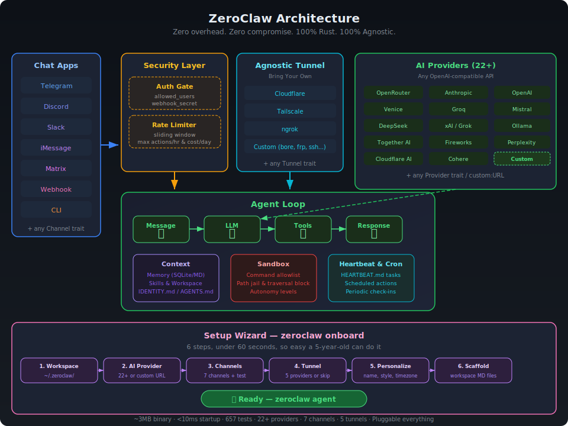

<p align="center">
  
</p>

<h1 align="center">ZeroClaw 🦀</h1>

<p align="center">
  <strong>Zero overhead. Zero compromise. 100% Rust. 100% Agnostic.</strong>
</p>

<p align="center">
  <a href="LICENSE"></a>
</p>

The fastest, smallest, fully autonomous AI assistant — deploy anywhere, swap anything.

```
~3MB binary · <10ms startup · 657 tests · 22+ providers · Pluggable everything
```

## Quick Start

```bash
git clone https://github.com/theonlyhennygod/zeroclaw.git
cd zeroclaw
cargo build --release

# Initialize config + workspace
cargo run --release -- onboard

# Set your API key
export OPENROUTER_API_KEY="sk-..."

# Chat
cargo run --release -- agent -m "Hello, ZeroClaw!"

# Interactive mode
cargo run --release -- agent

# Check status
cargo run --release -- status --verbose

# List tools (includes memory tools)
cargo run --release -- tools list

# Test a tool directly
cargo run --release -- tools test memory_store '{"key": "lang", "content": "User prefers Rust"}'
cargo run --release -- tools test memory_recall '{"query": "Rust"}'
```

> **Tip:** Run `cargo install --path .` to install `zeroclaw` globally, then use `zeroclaw` instead of `cargo run --release --`.

## Architecture

Every subsystem is a **trait** — swap implementations with a config change, zero code changes.

<p align="center">
  
</p>

| Subsystem | Trait | Ships with | Extend |
|-----------|-------|------------|--------|
| **AI Models** | `Provider` | 22+ providers (OpenRouter, Anthropic, OpenAI, Venice, Groq, Mistral, etc.) | `custom:https://your-api.com` — any OpenAI-compatible API |
| **Channels** | `Channel` | CLI, Telegram, Discord, Slack, iMessage, Matrix, Webhook | Any messaging API |
| **Memory** | `Memory` | SQLite (default), Markdown | Any persistence |
| **Tools** | `Tool` | shell, file_read, file_write, memory_store, memory_recall, memory_forget | Any capability |
| **Observability** | `Observer` | Noop, Log, Multi | Prometheus, OTel |
| **Runtime** | `RuntimeAdapter` | Native (Mac/Linux/Pi) | Docker, WASM |
| **Security** | `SecurityPolicy` | Sandbox + allowlists + rate limits | — |
| **Tunnel** | `Tunnel` | None, Cloudflare, Tailscale, ngrok, Custom | Any tunnel binary |
| **Heartbeat** | Engine | HEARTBEAT.md periodic tasks | — |

### Memory System

ZeroClaw has a built-in brain. The agent automatically:
1. **Recalls** relevant memories before each prompt (context injection)
2. **Saves** conversation turns to memory (auto-save)
3. **Manages** its own memory via tools (store/recall/forget)

Two backends — **SQLite** (default, searchable, upsert, delete) and **Markdown** (human-readable, append-only, git-friendly). Switch with one config line.

### Security Architecture

ZeroClaw enforces security at **every layer** — not just the sandbox. Every message passes through authentication and rate limiting before reaching the agent.

#### Layer 1: Channel Authentication

Every channel validates the sender **before** the message reaches the agent loop:

| Channel | Auth Method | Config |
|---------|------------|--------|
| **Telegram** | `allowed_users` list (username match) | `[channels.telegram] allowed_users` |
| **Discord** | `allowed_users` list (user ID match) | `[channels.discord] allowed_users` |
| **Slack** | `allowed_users` list (user ID match) | `[channels.slack] allowed_users` |
| **Matrix** | `allowed_users` list (MXID match) | `[channels.matrix] allowed_users` |
| **iMessage** | `allowed_contacts` list | `[channels.imessage] allowed_contacts` |
| **Webhook** | `X-Webhook-Secret` header (shared secret) | `[channels.webhook] secret` |
| **CLI** | Local-only (inherently trusted) | — |

> **Note:** An empty `allowed_users` list or `["*"]` allows all users (open mode). Set specific IDs for production.

#### Layer 2: Rate Limiting

- **Sliding-window tracker** — counts actions within a 1-hour rolling window
- **`max_actions_per_hour`** — hard cap on tool executions (default: 20)
- **`max_cost_per_day_cents`** — daily cost ceiling (default: $5.00)

#### Layer 2.5: Agnostic Tunnel

Expose your gateway securely to the internet — **bring your own tunnel provider**. ZeroClaw doesn't lock you into Cloudflare or any single vendor.

| Provider | Binary | Use Case |
|----------|--------|----------|
| **none** | — | Local-only (default) |
| **cloudflare** | `cloudflared` | Cloudflare Zero Trust tunnel |
| **tailscale** | `tailscale` | Tailnet-only (`serve`) or public (`funnel`) |
| **ngrok** | `ngrok` | Quick public URLs, custom domains |
| **custom** | Any | Bring your own: bore, frp, ssh, WireGuard, etc. |

```toml
[tunnel]
provider = "tailscale"   # "none", "cloudflare", "tailscale", "ngrok", "custom"

[tunnel.tailscale]
funnel = true            # true = public internet, false = tailnet only

# Or use Cloudflare:
# [tunnel]
# provider = "cloudflare"
# [tunnel.cloudflare]
# token = "your-tunnel-token"

# Or ngrok:
# [tunnel]
# provider = "ngrok"
# [tunnel.ngrok]
# auth_token = "your-ngrok-token"
# domain = "my-zeroclaw.ngrok.io"  # optional

# Or bring your own:
# [tunnel]
# provider = "custom"
# [tunnel.custom]
# start_command = "bore local {port} --to bore.pub"
# url_pattern = "https://"         # regex to extract URL from stdout
# health_url = "http://localhost:4040/api/tunnels"  # optional
```

The tunnel starts automatically with `zeroclaw gateway` and prints the public URL.

#### Layer 3: Tool Sandbox

- **Workspace sandboxing** — can't escape workspace directory
- **Command allowlisting** — only approved shell commands (`git`, `cargo`, `ls`, etc.)
- **Path traversal blocking** — `..` and absolute paths blocked
- **Forbidden paths** — `/etc`, `/root`, `~/.ssh`, `~/.gnupg` always blocked
- **Autonomy levels** — `ReadOnly` (observe only), `Supervised` (acts with policy), `Full` (autonomous within bounds)

## Configuration

Config: `~/.zeroclaw/config.toml` (created by `onboard`)

## Documentation Index

Fetch the complete documentation index at: https://docs.openclaw.ai/llms.txt
Use this file to discover all available pages before exploring further.

## Token Use & Costs

ZeroClaw tracks **tokens**, not characters. Tokens are model-specific, but most
OpenAI-style models average ~4 characters per token for English text.

### How the system prompt is built

ZeroClaw assembles its own system prompt on every run. It includes:

* Tool list + short descriptions
* Skills list (only metadata; instructions are loaded on demand with `read`)
* Self-update instructions
* Workspace + bootstrap files (`AGENTS.md`, `SOUL.md`, `TOOLS.md`, `IDENTITY.md`, `USER.md`, `HEARTBEAT.md`, `BOOTSTRAP.md` when new, plus `MEMORY.md` and/or `memory.md` when present). Large files are truncated by `agents.defaults.bootstrapMaxChars` (default: 20000). `memory/*.md` files are on-demand via memory tools and are not auto-injected.
* Time (UTC + user timezone)
* Reply tags + heartbeat behavior
* Runtime metadata (host/OS/model/thinking)

### What counts in the context window

Everything the model receives counts toward the context limit:

* System prompt (all sections listed above)
* Conversation history (user + assistant messages)
* Tool calls and tool results
* Attachments/transcripts (images, audio, files)
* Compaction summaries and pruning artifacts
* Provider wrappers or safety headers (not visible, but still counted)

### How to see current token usage

Use these in chat:

* `/status` → **emoji-rich status card** with the session model, context usage,
  last response input/output tokens, and **estimated cost** (API key only).
* `/usage off|tokens|full` → appends a **per-response usage footer** to every reply.
  * Persists per session (stored as `responseUsage`).
  * OAuth auth **hides cost** (tokens only).
* `/usage cost` → shows a local cost summary from ZeroClaw session logs.

Other surfaces:

* **TUI/Web TUI:** `/status` + `/usage` are supported.
* **CLI:** `zeroclaw status --usage` and `zeroclaw channels list` show
  provider quota windows (not per-response costs).

### Cost estimation (when shown)

Costs are estimated from your model pricing config:

```
models.providers.<provider>.models[].cost
```

These are **USD per 1M tokens** for `input`, `output`, `cacheRead`, and
`cacheWrite`. If pricing is missing, ZeroClaw shows tokens only. OAuth tokens
never show dollar cost.

### Cache TTL and pruning impact

Provider prompt caching only applies within the cache TTL window. ZeroClaw can
optionally run **cache-ttl pruning**: it prunes the session once the cache TTL
has expired, then resets the cache window so subsequent requests can re-use the
freshly cached context instead of re-caching the full history. This keeps cache
write costs lower when a session goes idle past the TTL.

Configure it in Gateway configuration and see the behavior details in
[Session pruning](/concepts/session-pruning).

Heartbeat can keep the cache **warm** across idle gaps. If your model cache TTL
is `1h`, setting the heartbeat interval just under that (e.g., `55m`) can avoid
re-caching the full prompt, reducing cache write costs.

For Anthropic API pricing, cache reads are significantly cheaper than input
tokens, while cache writes are billed at a higher multiplier. See Anthropic's
prompt caching pricing for the latest rates and TTL multipliers:
[https://docs.anthropic.com/docs/build-with-claude/prompt-caching](https://docs.anthropic.com/docs/build-with-claude/prompt-caching)

#### Example: keep 1h cache warm with heartbeat

```yaml
agents:
  defaults:
    model:
      primary: "anthropic/claude-opus-4-6"
    models:
      "anthropic/claude-opus-4-6":
        params:
          cacheRetention: "long"
    heartbeat:
      every: "55m"
```

### Tips for reducing token pressure

* Use `/compact` to summarize long sessions.
* Trim large tool outputs in your workflows.
* Keep skill descriptions short (skill list is injected into the prompt).
* Prefer smaller models for verbose, exploratory work.

```toml
api_key = "sk-..."
default_provider = "openrouter"
default_model = "anthropic/claude-sonnet-4-20250514"
default_temperature = 0.7

[memory]
backend = "sqlite"  # "sqlite", "markdown", "none"
auto_save = true

[autonomy]
level = "supervised"  # "readonly", "supervised", "full"
workspace_only = true
allowed_commands = ["git", "npm", "cargo", "ls", "cat", "grep"]

[heartbeat]
enabled = false
interval_minutes = 30
```

## Commands

| Command | Description |
|---------|-------------|
| `onboard` | Initialize workspace and config |
| `agent -m "..."` | Single message mode |
| `agent` | Interactive chat mode |
| `status -v` | Show full system status |
| `tools list` | List all 6 tools |
| `tools test <name> <json>` | Test a tool directly |
| `gateway` | Start webhook/WebSocket server |

## Development

```bash
cargo build              # Dev build
cargo build --release    # Release build (~3MB)
cargo test               # 657 tests
cargo clippy             # Lint (0 warnings)

# Run the SQLite vs Markdown benchmark
cargo test --test memory_comparison -- --nocapture
```

## Project Structure

```
src/
├── main.rs           # CLI (clap)
├── lib.rs            # Library exports
├── agent/            # Agent loop + context injection
├── channels/         # Channel trait + CLI
├── config/           # TOML config schema
├── cron/             # Scheduled tasks
├── heartbeat/        # HEARTBEAT.md engine
├── memory/           # Memory trait + SQLite + Markdown
├── observability/    # Observer trait + Noop/Log/Multi
├── providers/        # Provider trait + 22 providers
├── runtime/          # RuntimeAdapter trait + Native
├── security/         # Sandbox + allowlists + autonomy
├── tools/            # Tool trait + shell/file/memory tools
└── tunnel/           # Tunnel trait + Cloudflare/Tailscale/ngrok/Custom
examples/
├── custom_provider.rs
├── custom_channel.rs
├── custom_tool.rs
└── custom_memory.rs
tests/
└── memory_comparison.rs  # SQLite vs Markdown benchmark
```

## License

MIT — see [LICENSE](LICENSE)

## Contributing

See [CONTRIBUTING.md](CONTRIBUTING.md). Implement a trait, submit a PR:
- New `Provider` → `src/providers/`
- New `Channel` → `src/channels/`
- New `Observer` → `src/observability/`
- New `Tool` → `src/tools/`
- New `Memory` → `src/memory/`

---

**ZeroClaw** — Zero overhead. Zero compromise. Deploy anywhere. Swap anything. 🦀
